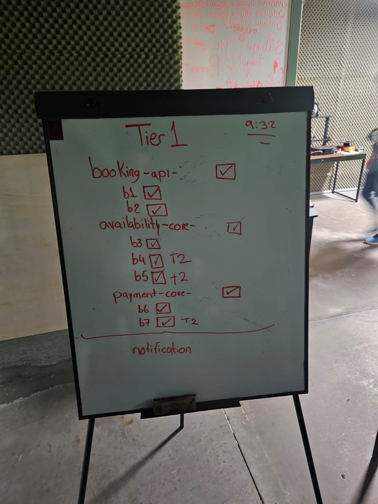
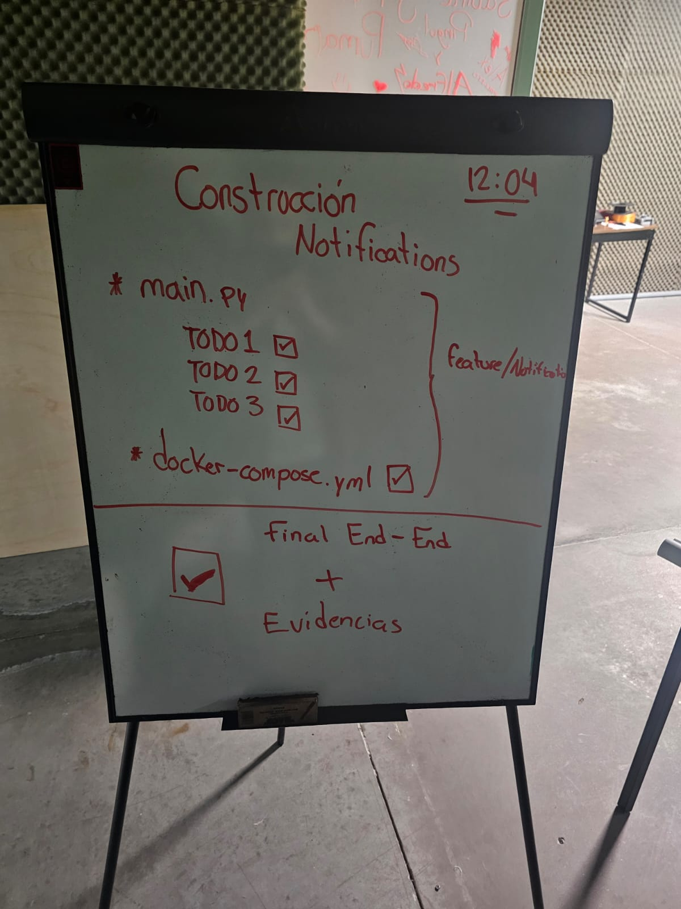

# Integrantes de la pareja

> **Llenen este archivo antes de empezar a tocar código**. Es parte de la calificación (4 pts) y la base para evaluar el balance de trabajo entre los dos.

## Integrante 1

- **Nombre completo: Bernardo Bojalil Lorenzini**
- **Matrícula: 195908**
- **Correo: bernardo.bojalil@iberopuebla.mx**
- **Usuario de Git que va a usar para sus commits: BERNARDOBOJALIL**

## Integrante 2

- **Nombre completo: Emiliano Montoya Velázquez**
- **Matrícula: 197002**
- **Correo: emiliano.montoya@iberopuebla.mx**
- **Usuario de Git que va a usar para sus commits: MontoyaEmiliano**

---

## División inicial del trabajo

> Antes de empezar, acuerden quién va a tomar qué. Pueden dividir por servicio, por tier, por bug, o como les acomode. Si después cambian, actualicen la tabla.

| Bug / Tarea | Responsable principal | Apoyo |
|---|---|---|
| B1 — routing key en booking-api | Bernardo Bojalil | |
| B2 — manejo de error en publish | Bernardo Bojalil | |
| B3 — auto_ack en availability-service | Emiliano Montoya | |
| B4 — overlap de fechas | Emiliano Montoya | |
| B5 — race condition con `with_for_update()` | Emiliano Montoya | |
| B6 — credenciales hardcodeadas | Bernardo Bojalil | |
| B7 — idempotencia en payment-service | Bernardo Bojalil | |
| `notification-service` (TODOs) | Emiliano Montoya | Bernardo Bojalil |
| `notification-service` en docker-compose | Bernardo Bojalil | |
| Capturas de RabbitMQ | Bernardo Bojalil | |
| Logs end-to-end | Bernardo Bojalil | |
| `DECISIONES.md` | AMBOS | |
| `PROMPTS.md` | AMBOS | |
| Saga compensatoria | Bernardo Bojalil | |
| Tests, observabilidad, mejoras | Emiliano Montoya | |

---

## Resumen final del trabajo

> Llenen esto al terminar. Una o dos frases por integrante explicando qué cosas hicieron principalmente. La idea no es competir, es que quede claro que ambos participaron.

### Lo que hizo Integrante 1: Bernardo Bojalil

- Arreglé que los mensajes de booking nunca llegaban a availability-service porque el routing key estaba mal escrito
- Hice que el API devuelva un error claro (503) cuando RabbitMQ no está disponible, en lugar de silenciosamente no hacer nada
- Saqué las credenciales de Postgres que estaban escritas directo en el código de payment-service y las moví a variables de entorno
- Agregué una tabla para rastrear eventos ya procesados en payment-service, para que si RabbitMQ reentrega un mensaje no se cobre dos veces
- Configuré notification-service en docker-compose para que levante junto con el resto del sistema
- Tomé capturas del estado de RabbitMQ (exchanges, queues, bindings) y generé los logs end-to-end del flujo completo
- Como bonus, implementé la saga compensatoria: cuando un pago falla, se publica un evento que availability-service recibe para cancelar la reserva y liberar el cuarto

### Lo que hizo Integrante 2

---

## Notas sobre el trabajo en pareja

El examen lo hicimos juntos en persona desde el inicio hasta el final. La estrategia fue dividir el trabajo en "sprints" cortos y asignar cada tarea según qué archivos tocaba cada quien, para evitar conflictos al mergear las ramas. Por ejemplo, los bugs de `booking-api` y `payment-core` fueron para una persona, y los de `availability-core` para la otra — así cada quien vivía en su rama y los merges a `main` eran limpios.

Para organizarnos usamos un pizarrón físico donde anotamos las tareas, la hora de inicio de cada sprint y un checklist de qué iba quedando listo:

*Sprint inicial: todos los bugs del Tier 1 organizados por servicio (`booking-api`, `availability-core`, `payment-core`). Los checkmarks confirman qué iba quedando resuelto. Los marcados con "T2" (b4, b5, b7) eran bugs que también contaban para Tier 2.*

*Segundo sprint: construcción del `notification-service`. Los tres TODOs del `main.py` y la configuración en `docker-compose.yml` se hicieron en la rama `feature/Notifications`. Al final marcamos el flujo end-to-end completo con evidencias como el último paso.*

Las ramas del repo reflejan exactamente esa división:

- `booking-api` → bugs B1 y B2  
- `availability-core` → bugs B3, B4, B5  
- `payment-core` → bugs B6 y B7  
- `feature/Notifications` → TODOs del notification-service  
- `Tier3-Bonus` → saga compensatoria y tests

Todo se fue mergeando a `main` conforme se terminaba y verificaba cada parte.
